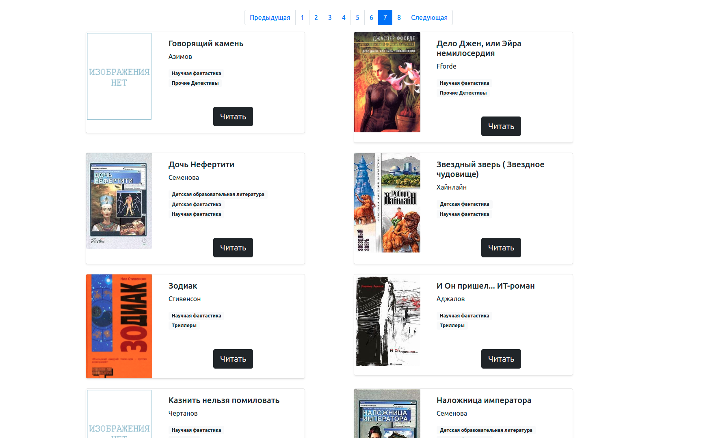

# Library of Science Fiction Books

The script is an example of creating a parsing library of science fiction books. In this case, from the indicated
the user of the pages will collect data in the form of titles, author, the text of the books in .txt format, page covers
and comments to the book, if any. The example data is taken from the website [tululu.org](https://tululu.org/).

## General launch

Download the code from GitHub. Install dependencies:

```sh
pip install -r requirements.txt
```

## Example of running a script to download data for a library

In the terminal, enter a command in which after --start_page the first desired page of the site is indicated, and after --end_page -
the last one. If you run the script without arguments, by default data from pages 1 to 701 will be downloaded.

```
python3 fetch_library_files.py --start_page 10 --end_page 30
```

You can add optional arguments to this command:

- --skip_imgs to skip downloading book covers
- --skip_txt to skip downloading book texts
- --dest_folder to specify the path to folders with books and covers, by default - **'library/'**
- --json_path to specify the path to the json file, default **'book_info.json'**
```
python3 fetch_library_files.py --start_page 10 --end_page 30 --skip_imgs --skip_txt --dest_folder new_library --json_path books.json
```

After the specified command, a progress bar will be displayed on the screen:

```
0%|          | 1/701 [00:33<6:32:06, 33.61s/it]
 ```

After downloading all the specified pages, a json file will also be saved indicating the author, genre, book title, link
on the book, as well as comments and links to the cover, if available.

```
 {
        "author": "ИВАНОВ Сергей",
        "title": "Алиби",
        "book_src": "library/books/Алиби.txt",
        "image_src": "library/covers/shots239.jpg",
        "genre": [
            "Научная фантастика",
            "Прочие Детективы"
        ],
        "comments": [
            "Детский вариант анекдотов про Шерлока Холмса)",
            "Загадки я люблю.)))",
            "А мне понравилось, люблю, знаете ли, всякие загадочки, головоломочки, кроссвордики, Гимнастика ума, одним словом... \nВо всём можно найти положительные моменты, не разгадал загадку, так хоть гренки научился готовить отменные... :-)",
            "Очень поучительное для ребенка 10 лет."
        ]
    },,
```

Default download folders created by the script in the root of the folder with the code:

- **'/books/'** for book texts
- **'/covers/'** for covers

## Example of running a script to create offline library website pages

In the root folder, create a ``` .env ``` file and add the following data to it:

```
JSON_PATH = 'path to json file'
DEST_FOLDER = 'path to the folder for books, covers and site pages'
PAGES_FOLDER = 'folder name for site pages'
```

Run the script with the command

```sh
python3 render_website.py
```

The pages for the library will be created in the folder specified in PAGES_FOLDER. Once you open any of the pages, you can navigate
around the library and read books.

## Example of how the site works

[Link to one of the library pages](https://sharipat.github.io/books-library-restyle/library/pages/index7.html).


