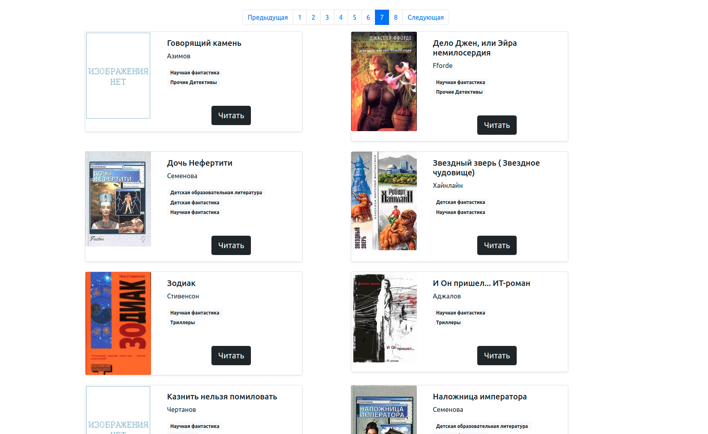

# Библиотека научно-фантастических книг

Скрипт представляет собой пример создания парсинг библиотеки научно-фантастических книг. В данном случае с указанных
пользователем страниц будут собраны данные в виде заголовков, автора, самого текста книг в формате .txt, обложек страниц
и комментариев к книге, при их наличии. Данные для примера берутся с сайта [tululu.org](https://tululu.org/).

## Запуск общий

Скачайте код с GitHub. Установите зависимости:

```sh
pip install -r requirements.txt
```

## Пример запуска скрипта для скачивания данных для библиотеки

В терминале введите команду, в которой после --start_page указывается первая желаемая страница сайта, а после --end_page -
последняя. Если запустить скрипт без аргументов, по умолчанию будут скачаны данные с 1 по 701 страницу.

```
python3 fetch_library_files.py --start_page 10 --end_page 30
```

К данной команде возможно добавление опциональных аргументов:

- --skip_imgs для пропуска скачивания обложек книг
- --skip_txt для пропуска скачивания текстов книг
- --dest_folder для указания пути к папкам с книгами и обложками, по умолчанию - **'library/'**
- --json_path для указания пути к файлу json, по умолчанию **'book_info.json'**

```
python3 fetch_library_files.py --start_page 10 --end_page 30 --skip_imgs --skip_txt --dest_folder new_library --json_path books.json
```

После указанной команды на экран выведется прогресс-бар:

```
0%|          | 1/701 [00:33<6:32:06, 33.61s/it]
 ```

После скачивания всех указанных страниц будет также сохранен файл json с указанием автора, жанра, названия книги, ссылки
на книгу, а также комментариев и ссылки на обложку, при их наличии.

```
 {
        "author": "ИВАНОВ Сергей",
        "title": "Алиби",
        "book_src": "library/books/Алиби.txt",
        "image_src": "library/covers/shots239.jpg",
        "genre": [
            "Научная фантастика",
            "Прочие Детективы"
        ],
        "comments": [
            "Детский вариант анекдотов про Шерлока Холмса)",
            "Загадки я люблю.)))",
            "А мне понравилось, люблю, знаете ли, всякие загадочки, головоломочки, кроссвордики, Гимнастика ума, одним словом... \nВо всём можно найти положительные моменты, не разгадал загадку, так хоть гренки научился готовить отменные... :-)",
            "Очень поучительное для ребенка 10 лет."
        ]
    },,
```

Дефолтные папки для скачивания, создающиеся скриптом в корне папки с кодом:

- **'/books/'** для текстов книг
- **'/covers/'** для обложек

## Пример запуска скрипта для создания страниц сайта оффлайн - библиотеки

В корневой папке создайте файл ``` .env ``` и добавьте в него следующие данные:

```
JSON_PATH = 'путь к файлу json'
DEST_FOLDER = 'путь к папке для книг, обложек и страниц сайта'
PAGES_FOLDER = 'название папки для страниц сайта'
```

Запустите скрипт командой

```sh
python3 render_website.py
```

В папке, указанной в PAGES_FOLDER, создадутся страницы для библиотеки. Открыв любую из страниц, вы сможете перемещаться
по библиотеке и читать книги.

## Пример работы сайта

[Ссылка на одну из страниц библиотеки](https://sharipat.github.io/books-library-restyle/library/pages/index7.html).



## Цели проекта

Код написан в учебных целях — для курса "Верстка для питониста" на сайте [Devman](https://dvmn.org).
